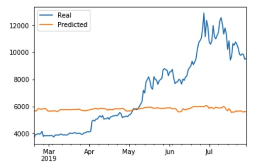
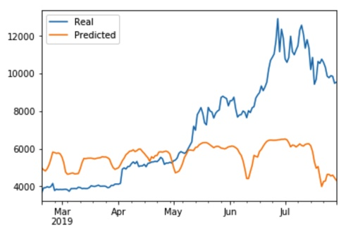
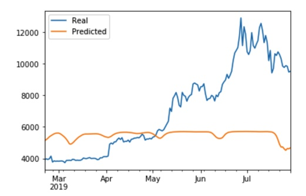
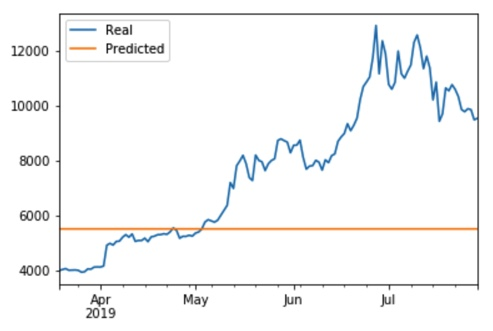
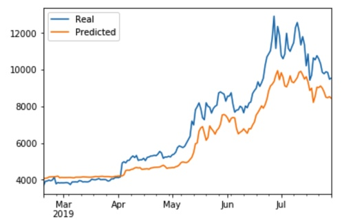
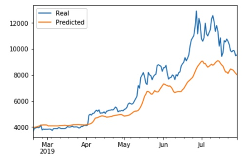
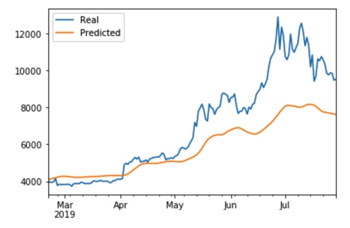
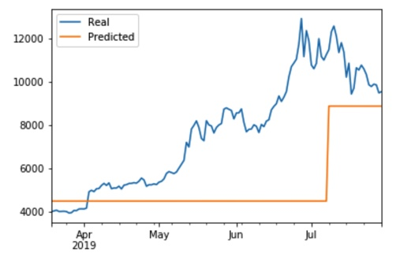

# LSTM Stock Predictor

### Model Results for FNG

#### FNG, window = 2, loss: 0.10

#### FNG, window = 5, loss: 0.10

#### FNG, window = 10, loss: 0.11

#### FNG, window = 100, loss: 0.13

### Model Results for Closing Prices

#### CLOSING PRICES, window = 2, loss: 0.01

#### CLOSING PRICES, window = 5, loss: 0.2

#### CLOSING PRICES, window = 10, loss: 0.39

#### CLOSING PRICES, window = 100, loss: 0.13

### Model evaluation performance

> Which model has a lower loss?
> The one using Closing Prices with a window of 2.

> Which model tracks the actual values better over time?
The one using Closing Prices with a window of 2.

> Which window size works best for the model?
For the Closing Prices: window of 2. For FNG: window of 5

